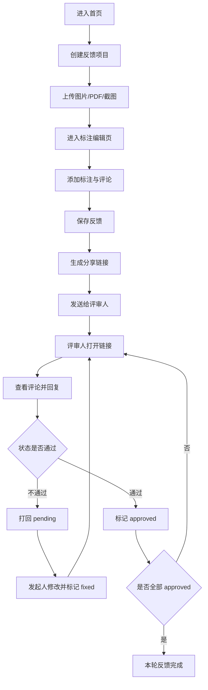
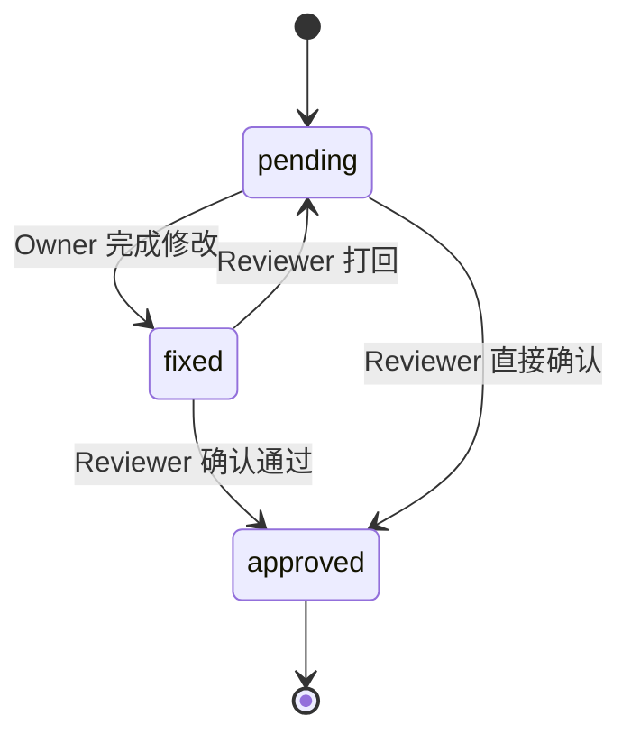
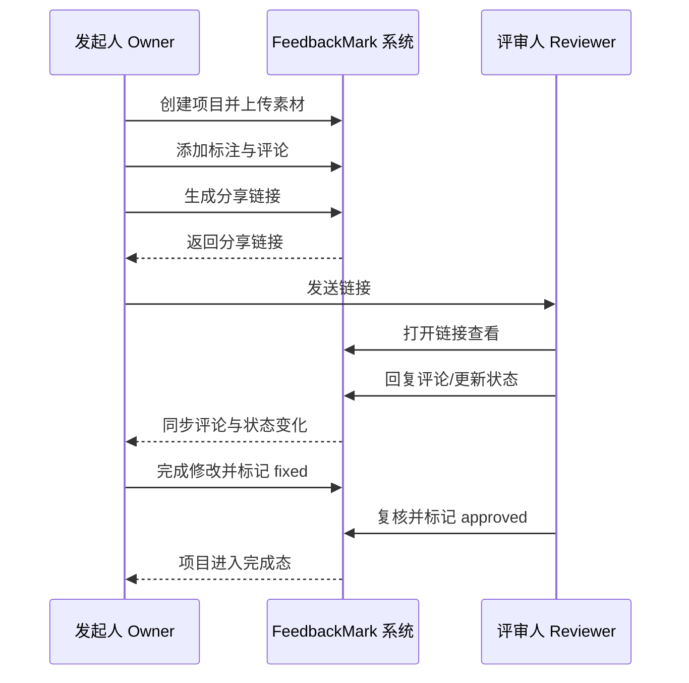

# FeedbackMark 系统功能说明（MVP）

## 1. 文档信息
- 文档版本：v1.0
- 更新时间：2026-04-04
- 适用范围：FeedbackMark Web 端 MVP
- 目标读者：产品、设计、前端、后端、测试

## 2. 产品定位与目标
FeedbackMark 是一个轻量级视觉反馈工具，面向 freelancer、设计师、营销人员和小团队。

核心价值：把原本分散在邮件、聊天、截图里的反馈过程，收敛为同一条可追踪流程。

MVP 只验证一个闭环：
上传文件 -> 标注反馈 -> 生成链接 -> 对方查看回复 -> 状态流转 -> 发起人收敛反馈

## 3. 范围定义
### 3.1 MVP 必做
- 上传图片 / PDF / 网页截图文件
- 预览文件内容
- 添加视觉标注（pin / arrow / rectangle / highlight）
- 添加文字评论
- 语音说明占位（按钮 + 附件字段，不做复杂录音处理）
- 保存评论
- 生成分享链接
- 客户打开分享链接查看反馈
- 客户回复评论
- 评论状态流转（`pending` / `fixed` / `approved`）
- Dashboard 查看项目列表与状态筛选

### 3.2 MVP 暂不做
- Figma 集成
- AI 自动总结
- 邮件自动通知
- 团队权限系统与复杂角色体系
- 浏览器插件 side panel
- 自动抓取真实网页 DOM
- 评论导出 PDF
- 计费系统
- 高级项目管理功能

## 4. 角色与权限
| 角色 | 说明 | 核心权限 |
| --- | --- | --- |
| 发起人（Owner） | 创建项目并主导反馈修订的人 | 创建项目、上传文件、添加/编辑标注、生成分享链接、修改评论状态 |
| 评审人（Reviewer） | 打开分享链接进行查看和回复的人 | 查看项目、回复评论、将评论标记为 `approved` 或打回 `pending` |

说明：MVP 阶段默认“持链接可访问”，不做完整账号权限系统。

## 5. 术语与状态字典
### 5.1 评论状态（唯一标准）
| 状态值 | 显示文案 | 含义 | 可由谁操作 |
| --- | --- | --- | --- |
| `pending` | 待处理 | 评论已提出，等待发起人处理 | Reviewer（打回）/ 系统初始 |
| `fixed` | 已修改 | 发起人表示该评论对应内容已修改 | Owner |
| `approved` | 已确认 | 评审人确认该评论已解决 | Reviewer |

### 5.2 评论状态流转规则
- `pending -> fixed`：发起人完成修改后手动设置。
- `fixed -> approved`：评审人确认通过。
- `fixed -> pending`：评审人认为仍需修改，打回。
- `pending -> approved`：小改动场景可直接确认。

### 5.3 项目总览状态（派生）
Dashboard 的项目状态由评论状态聚合得出：
- `pending`：存在任一 `pending` 评论。
- `fixed`：无 `pending`，且至少一个 `fixed`。
- `approved`：全部评论均为 `approved`。

## 6. 关键业务流程（详细）

### 6.1 流程 F-01：创建反馈项目并上传素材
前置条件：用户进入首页。

步骤：
1. 用户点击 `Start a Feedback Project`。
2. 系统进入创建页，要求填写 `Project title`。
3. 用户上传文件（图片/PDF/截图）。
4. 系统完成文件类型校验与大小校验。
5. 系统上传文件到存储并返回 `assetUrl`。
6. 系统创建 `Project` 记录，绑定 `assetType` 与 `assetUrl`。

结果：进入标注编辑页。

### 6.2 流程 F-02：标注并保存评论
前置条件：项目和素材已创建。

步骤：
1. 用户在画布选择标注工具（pin/arrow/rectangle/highlight）。
2. 用户在画布上落点或绘制区域，系统记录坐标与形状参数。
3. 用户输入文字评论，可选附加语音说明。
4. 用户点击 `Save feedback`。
5. 系统保存 `Comment`（含位置、内容、状态初值 `pending`）。
6. 页面左侧评论列表即时刷新；点击评论与画布标注双向高亮。

结果：评论可被后续分享和评审。

### 6.3 流程 F-03：生成并分发分享链接
前置条件：至少存在 1 条评论。

步骤：
1. 发起人点击 `Generate share link`。
2. 系统创建 `ShareLink`（随机 `token`，绑定 `projectId`）。
3. 系统返回可复制链接。
4. 发起人复制并通过 IM/邮件发送给评审人。

结果：评审人可通过链接进入查看页。

### 6.4 流程 F-04：评审人查看并回复
前置条件：评审人拿到有效分享链接。

步骤：
1. 评审人打开链接，系统校验 `token`。
2. 系统展示素材预览与评论列表。
3. 评审人逐条查看评论和标注位置。
4. 评审人可添加 `Reply`。
5. 评审人可将评论设为 `approved`，或将 `fixed` 打回 `pending`。

结果：评论与状态更新实时写入，发起人端可见。

### 6.5 流程 F-05：发起人修订并收敛反馈
前置条件：存在 `pending` 或被打回评论。

步骤：
1. 发起人根据回复完成设计修订。
2. 发起人在系统中将对应评论更新为 `fixed`。
3. 发起人通知评审人复核（可复用同一分享链接）。
4. 评审人复核后标记 `approved`。
5. 当项目评论全部 `approved`，项目进入完成态。

结果：本轮反馈闭环完成。

## 7. 流程图
### 7.1 主流程图


### 7.2 评论状态图


### 7.3 时序图


## 8. 页面功能说明

### 8.1 首页（Landing）
目标：让用户快速理解价值并启动项目。

页面元素：
- Hero 标题：`Visual feedback without the email chaos.`
- 副标题：`Upload screenshots, images, or PDFs, annotate directly, and share one clean review link.`
- 主按钮：`Start a Feedback Project`
- 次按钮：`See Demo`
- 三个价值点：`Annotate visually` / `Share instantly` / `Collect replies in one place`

### 8.2 创建项目页（Upload）
目标：最短路径创建可标注项目。

页面元素：
- `Project title` 输入
- 拖拽上传区（图片 / PDF / 截图）
- 文件预览卡片
- `Continue to Editor` 按钮

关键规则：
- 标题为空时禁用继续按钮。
- 非支持格式给出明确错误提示。

### 8.3 标注编辑页（Annotation Editor）
目标：完成核心标注与评论管理。

布局：
- 左侧：项目概览 + 评论列表
- 中间：文件预览画布
- 顶部：标注工具栏
- 右侧（可选）：当前评论详情

功能：
- 新增标注（pin/arrow/rectangle/highlight）
- 文本评论输入
- 语音说明占位按钮
- 状态切换（`pending`/`fixed`/`approved`）
- `Save feedback`
- `Generate share link`

交互要求：
- 点击画布标注点，自动定位并展开对应评论。
- 点击评论列表项，画布高亮对应标注。
- 工具栏保持精简，避免专业设计软件复杂度。

### 8.4 分享页/分享弹窗
目标：让“复制并发送链接”动作清晰明确。

页面元素：
- 分享链接输入框
- `Copy link` 按钮
- 复制成功提示
- `Open review page` 按钮

### 8.5 客户查看页（Client Review）
目标：非技术用户也能快速完成查看和反馈。

布局：
- 主区：素材预览 + 标注层
- 侧栏：评论列表 + 回复区

功能：
- 查看评论与标注位置
- 新增回复
- 更新评论状态（`approved` 或打回 `pending`）
- 查看评论作者信息

### 8.6 Dashboard（项目总览）
目标：发起人查看所有项目进度。

页面元素：
- 项目列表/卡片
- 展示字段：项目名、文件类型、创建时间、评论数量、状态汇总
- 筛选项：`All` / `Pending` / `Fixed` / `Approved`
- `Create New Project` 按钮

## 9. 接口草案（MVP）
| 接口 | 方法 | 用途 |
| --- | --- | --- |
| `/api/projects` | `POST` | 创建项目 |
| `/api/projects/:projectId` | `GET` | 获取项目详情 |
| `/api/projects/:projectId/comments` | `POST` | 新建评论 |
| `/api/projects/:projectId/comments` | `GET` | 获取评论列表 |
| `/api/comments/:commentId` | `PATCH` | 更新评论内容/状态 |
| `/api/comments/:commentId/replies` | `POST` | 新增回复 |
| `/api/projects/:projectId/share-links` | `POST` | 创建分享链接 |
| `/api/share/:token` | `GET` | 通过 token 获取公开评审页数据 |

关键约束：
- 所有写接口返回最新实体，便于前端直接更新缓存。
- `PATCH /api/comments/:commentId` 需校验状态流转是否合法。

## 10. 数据模型建议
```ts
type AssetType = "image" | "pdf" | "screenshot";
type CommentStatus = "pending" | "fixed" | "approved";

type Project = {
  id: string;
  title: string;
  ownerId: string;
  assetType: AssetType;
  assetUrl: string;
  createdAt: string;
  updatedAt: string;
};

type Comment = {
  id: string;
  projectId: string;
  page?: number; // PDF 页码，非 PDF 可为空
  x: number;
  y: number;
  width?: number; // 矩形/高亮可用
  height?: number;
  shapeType: "pin" | "arrow" | "rectangle" | "highlight";
  content: string;
  voiceNoteUrl?: string;
  status: CommentStatus;
  authorName: string;
  createdAt: string;
  updatedAt: string;
};

type Reply = {
  id: string;
  commentId: string;
  authorName: string;
  content: string;
  createdAt: string;
};

type ShareLink = {
  id: string;
  projectId: string;
  token: string;
  isPublic: boolean;
  expiresAt?: string;
  createdAt: string;
};
```

## 11. 校验与错误处理
### 11.1 输入校验
- 文件类型：仅允许图片/PDF/截图。
- 文件大小：超限即阻断上传并提示。
- 评论内容：空内容不允许保存。
- 回复内容：空内容不允许提交。

### 11.2 业务校验
- 不能直接从 `pending` 改为 `fixed` 以外的非法状态（除 `approved` 直达规则）。
- 无评论时不可生成分享链接。
- 无效或过期 token 不允许访问公开评审页。

### 11.3 建议错误码
| 错误码 | 场景 |
| --- | --- |
| `INVALID_FILE_TYPE` | 文件格式不支持 |
| `FILE_TOO_LARGE` | 文件超出大小限制 |
| `INVALID_STATUS_TRANSITION` | 评论状态流转不合法 |
| `SHARE_LINK_NOT_FOUND` | token 不存在 |
| `SHARE_LINK_EXPIRED` | token 已过期 |
| `VALIDATION_FAILED` | 通用参数校验失败 |

## 12. 可观测性要求
- 关键日志：项目创建、上传成功/失败、评论创建、状态变更、分享链接生成、公开访问。
- 关键指标：
  - 上传成功率
  - 从上传到首次评论的转化率
  - 分享链接打开率
  - `pending -> approved` 平均闭环时长
- 告警建议：上传失败率异常升高、公开链接访问错误率异常。

## 13. 技术实现方向（对齐当前仓库）
### 13.1 前端
- Vite + React + TypeScript
- Tailwind CSS + shadcn/ui
- React Router（路由）
- TanStack React Query（服务端状态缓存）

### 13.2 标注与预览
- 标注层：Fabric.js（优先）
- PDF 预览：PDF.js
- 图片预览：浏览器原生 + 标注覆盖层

### 13.3 后端与数据
- Supabase（Postgres + Storage）
- MVP 先采用链接访问，不强依赖完整 Auth

## 14. 验收标准（MVP）
- 用户可在 3 分钟内完成：上传 -> 标注 -> 分享。
- 评审人无需登录即可打开链接并回复评论。
- 评论状态能按规则流转，Dashboard 状态聚合正确。
- 至少支持图片和 PDF 两类素材的完整流程。
- 关键流程出现错误时有可读提示，不出现“静默失败”。

## 15. 待确认事项
- 分享链接是否默认永不过期，还是默认 7 天有效。
- 语音说明第一版是否仅占位，还是允许上传音频文件。
- 是否需要“评论删除”能力（MVP 可先不做）。
- Dashboard 是否需要分页（MVP 可先不做）。
